# 第2章　CIサーバ環境構築

本章では、前章で導入した仮想サーバ（CentOS 7）へCI（継続的インテグレーション）ツールとして [「 Jenkins 」](https://jenkins.io/ )と、
コンテンツ作成ツールとして静的ページジェネレータである [「 Hexo 」](https://hexo.io/)を導入し、CIサーバの構築を行います。

## 2-1. Jenkins導入手順

### Jenkinsのインストール

CIツール 「 Jenkins 」 を仮想サーバ(CentOS 7)へ導入します。
[「 Jenkins 」](https://jenkins.io/)の公式サイトから「Red Hat/Fedora/CentOS」パッケージのJenkinsをインストールします。
以下の手順はrootユーザで操作します。

#### JDKの導入

JenkinsはJavaで実装されているためJDKを導入します。
最新バージョンの Jenkins では Java7 以上が必要です。

```
yum install java-1.8.0-openjdk java-1.8.0-openjdk-devel
```

#### yumリポジトリへJenkinsの情報を追加

情報の追加にはwgetコマンドを使用するため、wgetコマンドが導入されていない場合は`#yum install wget`でインストールします。

```
# wget -O /etc/yum.repos.d/jenkins.repo https://pkg.jenkins-ci.org/redhat/jenkins.repo
# rpm --import https://pkg.jenkins-ci.org/redhat/jenkins-ci.org.key
```

#### Jenkinsをインストール

```
# yum install jenkins
```

#### 使用ポート変更

Jenkinsはデフォルトで8080ポートを使用します。
ポートを変更する場合は次の設定を行います。

```
# vi /etc/sysconfig/jenkins

-----省略-----
JENKINS_PORT="設定したいポート番号"
-----省略-----
```

#### 使用するポートをセキュリティグループおよびファイアウォールに設定

K5 IaaS サービスポータルより、仮想サーバのセキュリティグループおよび仮想ネットワークのファイアウォールにJenkinsのポートを許可するルールを追加します。

詳しくは以下をご覧下さい。

- [IaaS 機能説明書 セキュリティグループ機能](https://k5-doc.jp-east-1.paas.cloud.global.fujitsu.com/doc/jp/iaas/document/function-manual/index.html#concept/concept_network_securitygroup.html)
- [IaaS 機能説明書 ファイアーウォールサービス](https://k5-doc.jp-east-1.paas.cloud.global.fujitsu.com/doc/jp/iaas/document/function-manual/index.html#concept/concept_network_fwaas.html)

#### Jenkinsを起動

```
#起動
systemctl start jenkins

#停止
systemctl stop jenkins

#システム起動時に自動起動させる設定
chkconfig jenkins on
```

#### WebブラウザでJenkinsの起動確認

`http://<仮想マシンのFQDNまたはIPアドレス>:<設定したポート番号>`


【 図１ Jenkins初期画面 】
  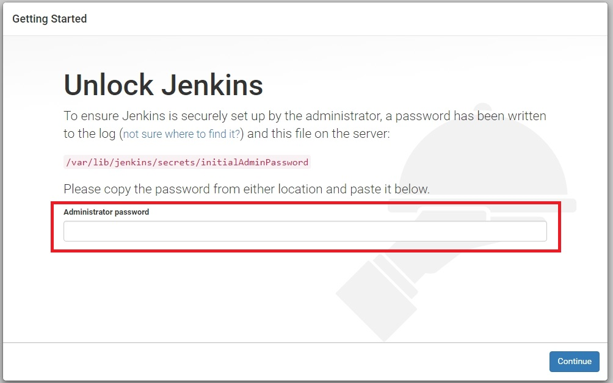

初回起動時は管理者が起動していることを確認するため、管理者パスワード「Administrator password」の入力を求められます。（ 図１赤枠部分 ）
管理者パスワード「Administrator password」は、Jenkinsをインストールした仮想サーバで確認できます。

`cat /var/lib/jenkins/secrets/initialAdminPassword`


管理者パスワードを入力すると、通常は「図4 Customize Jenkins」画面が表示されます。

しかしProxyサーバが設置されている環境では「図2 Offline」画面が表示されます。

【 図2 Offline画面 】
  

「Configure Proxy」をクリックし、図3の画面でProxyサーバのIPアドレス・ポートなどを順に入力し、「Save and Continue」を押下します。
【 図3 Jenkins Proxy画面 】
  

次に「図4 Customize Jenkins」画面が表示されます。
ここでは Jenkinsを拡張・カスタマイズするプラグインのインストールが選択できます。
2つ選択肢が提示されますのでお選びください。

- 「Install suggested plugins」（推奨プラグインの一括インストール）
- 「Select plugins to install」（プラグインを選択してインストール）

選択してインストールしたいプラグインがなければ、「Install suggested plugins」（推奨プラグインの一括インストール）を選択します。
【 図4 Customize Jenkins画面 】
  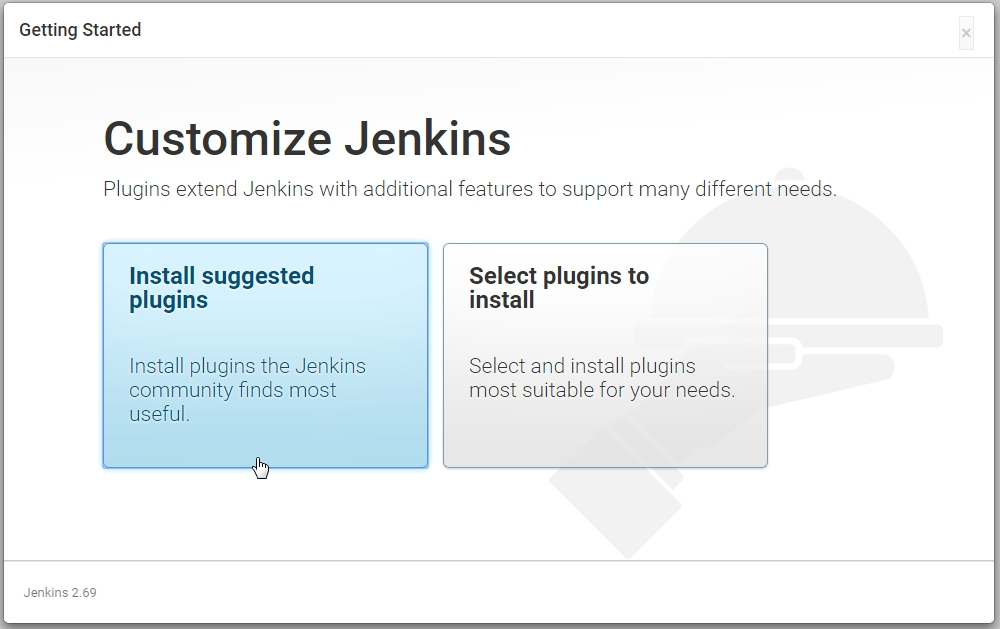

「Install suggested plugins」を押下しましたら以下のように自動的にプラグインがインストールされます。
【 図5 Plugin Install画面 】
  

プラグインのインストールが完了すると、「図5 管理者ユーザーアカウント設定画面」が表示されます。
【 図6 管理者ユーザーアカウント設定画面 】
  

必要な項目を入力して［ Save and Finish ］ボタンを押します。
[ Continue as admin ]を選択した場合は、
管理者アカウントのユーザー名は"admin"、
パスワードは初回起動時に入力したものになります。

初期設定が問題なく準備できましたら「図6 準備完了画面」が表示されます。
【 図7 準備完了画面 】
  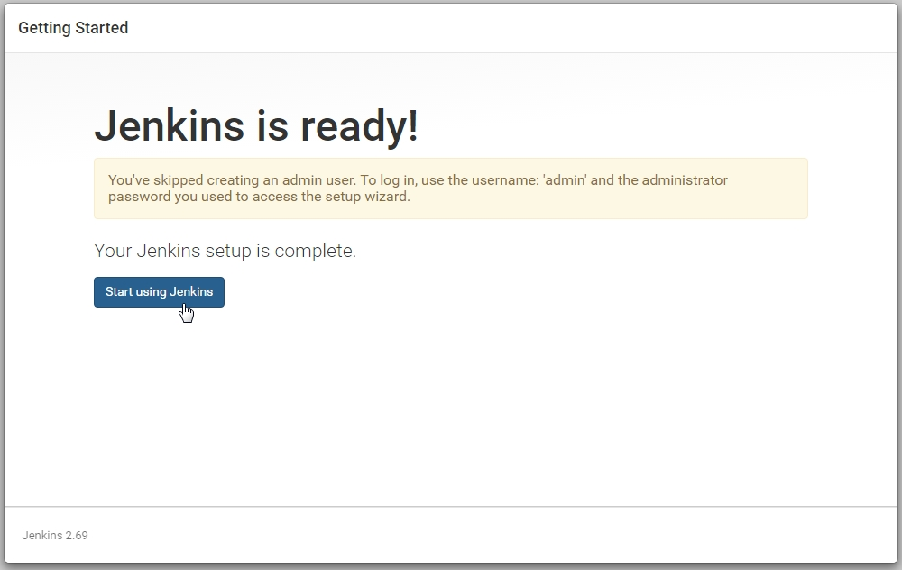

[ Start Using Jenkins ] ボタンを押下することで「Jenkinsオープニング画面」に移動し、Jenkinsが利用可能になります。
【 図8 Jenkinsオープニング画面 】
  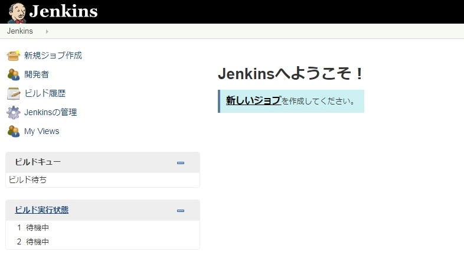

### 仮想サーバのJenkinsユーザについて

インストールすると自動的に jenkins グループと jenkins ユーザが作成されます。

**Jenkinsの構成**

ディレクトリ                         | パス
:----------------------------------- | :------------------------------------------
JENKINS_HOME                         | /var/lib/jenkins
設定ファイル                         | /etc/sysconfig/jenkins
キャッシュフォルダ                   | /var/cache/jenkins
ログフォルダ                         | /var/log/jenkins

いずれのフォルダも 【 ユーザ： jenkins 】、 【 グループ： jenkins 】 となっています。

**Jenkinsユーザの権限設定の方法**

CI環境を構築し、導入した各種ツールをJenkinsから操作する場合、仮想OSのJenkinsユーザに権限を与える、パスを通すなどの作業が必要になります。
本ガイドではJenkinsユーザにsudoコマンドを設定し、以下手順を進めます。
権限やパスの設定に際しては必ず開発グループなどのセキュリティ規定を考慮し、ご判断ください。

-------------------------------------------------------------------------------------------------------------------------------------

【 例 】 ログインシェルの変更、suコマンドの設定

Jenkins ユーザのログインシェルはデフォルトでは/bin/false に設定されています。

ここを変更することによってsuコマンドでJenkinsユーザへの切り替えが可能になります。

suコマンドでは「su rootを実行できるユーザ間でrootのパスワードを共有することになる」
「su実行後のコマンドの実行履歴がログに残らない」などセキュリティ面に懸念がありますのでご注意ください。

```
# ユーザの確認
cat /etc/passwd | grep jenkins
jenkins:x:996:994:Jenkins Automation Server:/var/lib/jenkins:/bin/false

# ログインシェル /bin/false　→　/bin/bash へ変更
chsh -s /bin/bash jenkins
jenkins のシェルを変更します。
シェルを変更しました。

# もう一度確認すると /bin/bashに変更されているのがわかります。
cat /etc/passwd | grep jenkins
jenkins:x:996:994:Jenkins Automation Server:/var/lib/jenkins:/bin/bash

# 以上でsuコマンドでjenkinsユーザへ切り替わります。
su - jenkins
[Jenkinsユーザ名]$
```

【 例 】 sudoコマンド設定

sudoコマンドでは、あるユーザが別のユーザとしてコマンドを実行できるようになります。

suコマンドではできなかった特定のコマンド単位で権限を制限することも可能です。

セキュリティ面ではsuよりもsudoの方が強化されていますが、ログイン可能なユーザはroot権限を持つことになりますので、設定に際してはご注意ください。

```
# rootより設定を行います。

# Jenkinsユーザをwheelグループに追加します。
usermod -aG wheel jenkins

# visudoによりwheelグループの権限確認。コメントアウトされていれば「#」を外します。
visudo
## Allows people in group wheel to run all commands
%wheel  ALL=(ALL)       ALL

# sudoの実行をパスワードなしで許可する場合は同様に「#」を外します。
## Same thing without a password
%wheel        ALL=(ALL)       NOPASSWD: ALL

# Jenkinsユーザでログインしsudoが可能か確認。
[jenkinsユーザ]$sudo whoami
root

```
以上でsudoコマンドが利用可能になり、Jenkinsユーザからroot権限が必要なコマンドが実行できるようになります。

## 2-2. Jenkinsの操作画面について

**ジョブ作成手順**

Jenkins上で実行される処理を「ジョブ」と呼びます。Jenkinsを利用してCI環境を構築するには各種テストやデプロイなどの「ジョブ」を作成していきます。

ここでは基本的な操作のみを紹介します。具体的なジョブの制作例は第7章で紹介します。

「test-job」という名称のジョブを作成します。

1. トップページ [ 新規ジョブ作成 ] 押下
  

2. 「Enter an item name」欄にジョブ名「test-job」を入力し、「フリースタイルプロジェクトのビルド」を選択。


3. 「設定画面」に遷移したら「ビルド」の「ビルド手順の追加」から「シェルの実行」を選択。
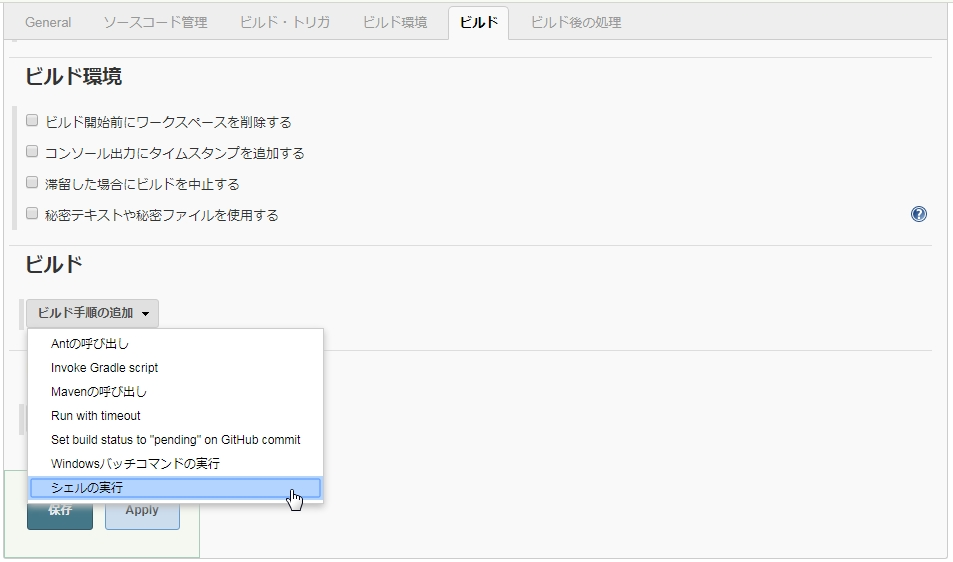

4. 実施したい処理のシェルスクリプトを記述します。
ここではコンソール画面に「Hello! Mr. Jenkins!」と表示する処理を記述します。
「保存」ボタンを押下すればジョブの完成です。


5. 完成したジョブ「test-job」を実行します。
「ビルド実行」を押下すると「ビルド履歴」が表示されます。
ビルドが成功していれば青い丸とともに履歴が表示されます。


6. 確認のためコンソール画面を表示します。
先程の「ビルド履歴」から確認したいビルドの「# 番号」を選び、押下します。
左側のメニューの「コンソール出力」を押下すれば表示されます。


以上がジョブ作成の基本です。

**Pipeline作成手順**

「Pipeline」とは、各ジョブをつなげ、自動で処理（ステップ）を実行する機能です。Jenkins 2.0以降では標準装備されています。

Pipelineではビルドやテストなど実行したい処理（ステップ）を「ステージ」ごとに定義することが可能であり、
各ステージの管理が容易に行えます。さらに開発・テストの進捗にあわせてステージの増減や順番の変更も可能です。

Jenkinsを利用してビルド→テスト→デプロイなどの流れを自動化する場合、「Pipeline」機能が活用できます。

ここでは基本的な設定のみを紹介します。具体的な「Pipeline」の制作例は第7章で紹介します。

動作環境

- jenkins2.0 以上
- java SE 7 以上
- Pipeline Plugin ( jenkins2.0では標準装備 )

手順

[ 新規ジョブの作成 ] → [ パイプライン ]を選択
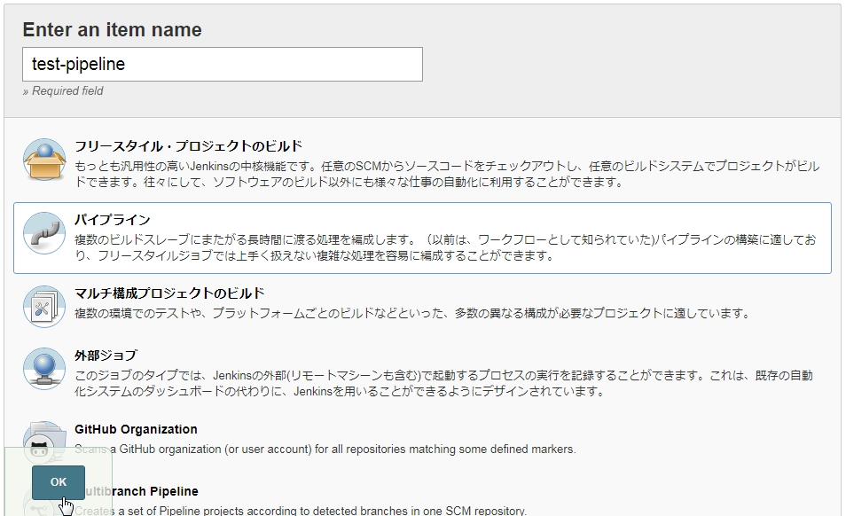

ジョブの詳細設定画面でPipelineエリアにスクリプト記述します。
【Pipeline設定画面】
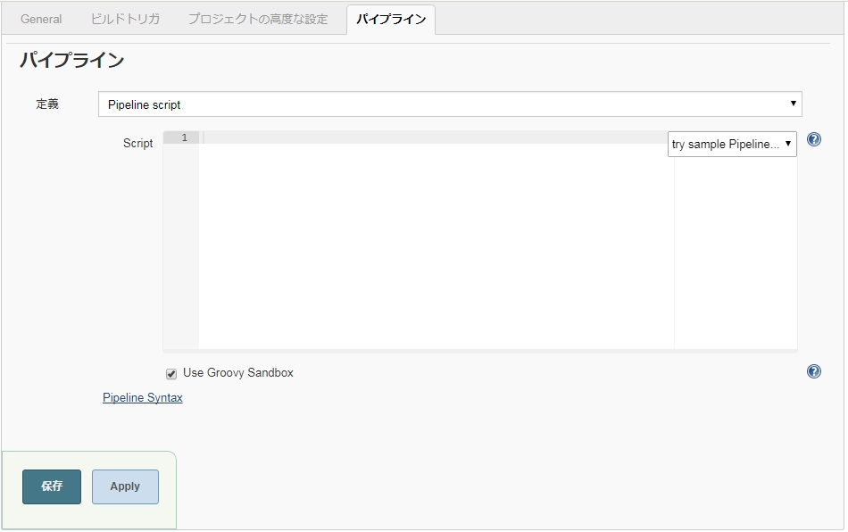

スクリプト記述の基本形

   Pipelineでは、ステージごとに処理（ステップ）を分け、それらを段階的に実行することが可能です。
   その基本的なスクリプトの記述例が以下になります。

  ```
  node {
    stage('ステージ名'){
      このステージで実行する処理を記述
      }
    stage('ステージ名'){
      このステージで実行する処理記述
      }
    stage('ステージ名'){
      このステージで実行する処理記述
      }
    ･･･省略･･･
  }
  ```

また、Pipeline設定画面の下部にある「Pipeline Syntax」を押下するとサンプルコードやリファレンスを参照することができます。
Jenkinsの公式サイトに[ Pipeline Steps Reference ](https://jenkins.io/doc/pipeline/steps/)が掲載されていますのでご参考ください。
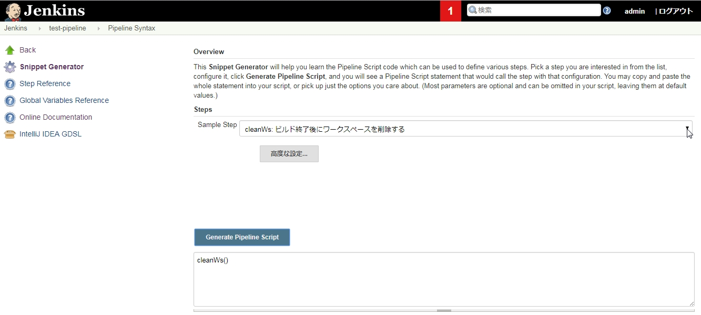

基本的なPipelineを作成して実行します。
Pipeline名は「test-pipeline」とします。
実行する処理は Stage01で「 Hello! Mr.Jenkins.」、Stage02で「 Bye! Mr.Jenkins.」とコンソールに出力します。

```
node {
    stage('stage01'){
        sh 'echo "Hello! Mr.Jenkins."'
    }
    stage('stage02'){
        sh 'echo "Bye! Mr.Jenkins"'
    }
}
```

上記のスクリプトを 【Pipeline設定画面】の「パイプライン」-「Script」欄に記述し、設定を保存したら、ビルドを実行します。

Pipelineが上手く実行されれば下図のような実行結果が表示されます。

【Pipeline実行結果画面】
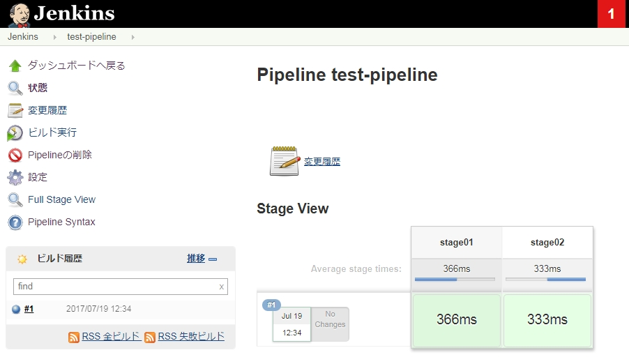

**プラグイン機能**

Jenkins ではプラグインにより機能を拡張することが出来るのが大きな特徴です。

豊富なプラグインが用意されており、Jenkins の管理画面からプラグインを検索し、インストールすることで簡単にプラグインを導入できます。

プラグイン導入手順

`トップ画面の「Jenkinsの管理」→「プラグインの管理」→「利用可能」から 利用したいプラグインを選択 `

※Jenkins のプラグインには、特定のプラグインを利用するために他のプラグインを導入する必要がある場合があります。プラグインの依存関係に注意してください。


本ガイドで必要となるプラグイン

- [Git Plugin](https://wiki.jenkins.io/display/JENKINS/Git+Plugin)

  インストール後、「GitHub Enterprise」と連携したJenkinsのジョブが作成可能になります。

- [SSH Agent Plugin](https://jenkins.io/doc/pipeline/steps/ssh-agent/)

  SSH鍵認証を行えるようになります。

なお、「プラグインの管理」画面で「インストール済み」タブを選択すれば、既に導入済みの プラグイン が確認できます。

初期画面ではAから始まる名称のプラグインの一覧が表示されます。

画面右上の[ フィルター ]欄に検索したいプラグイン名を記入し検索することも可能です。


**メール機能**

Jenkinsではビルドの実行結果をメールで通知することができます。
基本的な「E-mail 通知」機能では、ビルド失敗時にのみメールが送信される設定ですが、
メール機能を拡張するプラグイン「Email Extension Plugin」を導入すれば、「拡張E-mail通知」の設定が可能になります。
ビルド失敗時だけでなく成功時にもメールを送信することができ、ビルドの実行状況に応じて送信内容を変更するなどのカスタマイズが可能になります。

**基本的なメール設定**

SMTPメールサーバーの設定

`トップ画面「Jenkinsの管理」→「システムの設定」→「E-mail 通知」`
SMTPサーバーが用意できない場合は Gmail のSMTPサーバが利用できます。
以下は Gmail のSMTPサーバを利用した設定です。

設定項目                  | 設定値
:------------------------ | :------------------------
SMTPサーバー              |   smtp.gmail.com
E-mailのサフィックス      |   @gmail.com
SMTP認証                  |   チェックを入れます
ユーザ名                  |   Gmailのアカウント(xxx@gmail.com)
パスワード                |   Gmailのパスワード
SSL                       |   チェックを入れます
SMTPポート                |   465(SMTP over SSL) または 587(SMTP TLS/STARTTLS）
返信先アドレス            |   必要にあわせて記入
文字セット                |   UTF-8
メールを送信して設定を確認|   任意

【設定例 画像】

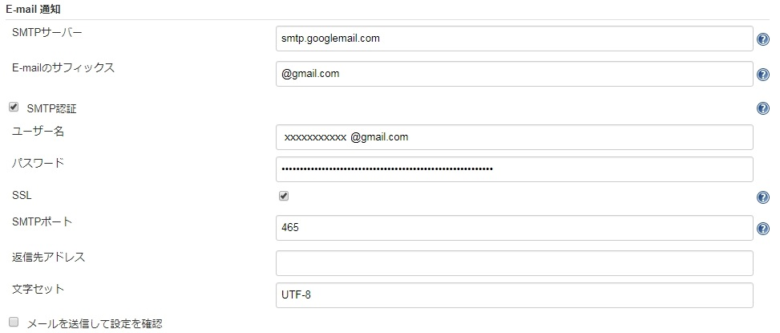

各ジョブでの設定

メール通知を設定したいジョブの[ 設定画面 ] → [ ビルド後の処理 ]にある[ ビルド後の処理の追加 ]を押下し、プルダウンメニューから[ E-mail通知 ]を選択します。

以下の画面が表示されますので、宛先にアドレスを記入することでメールがビルド失敗時に送信されるようになります。


**拡張E-mail通知の設定**

設定場所は `トップ画面「Jenkinsの管理」→「システムの設定」→「拡張E-mail 通知」`
「拡張E-mail通知」では様々な設定が可能であり、設定項目も数多く用意されています。
本ガイドでは、最低限必要な項目の紹介のみ行います。

設定項目                        | 設定する内容
:------------------------------ | :------------------------------
SMTPサーバー                    | 送信に利用するSMTPサーバを設定
デフォルトE-mailのサフィックス  | @以降のデフォルト値を設定
デフォルトコンテンツ形式        | プレーンテキスト形式かhtmlメール形式か選択
Default Recipients              | 送信先メールアドレス
デフォルトサブジェクト          | デフォルトのメールタイトルを設定
デフォルトコンテンツ            | デフォルトのメールの本文を設定

以下は Gmail のSMTPサーバを利用した設定です。
【拡張E-mail通知 設定例 画像】

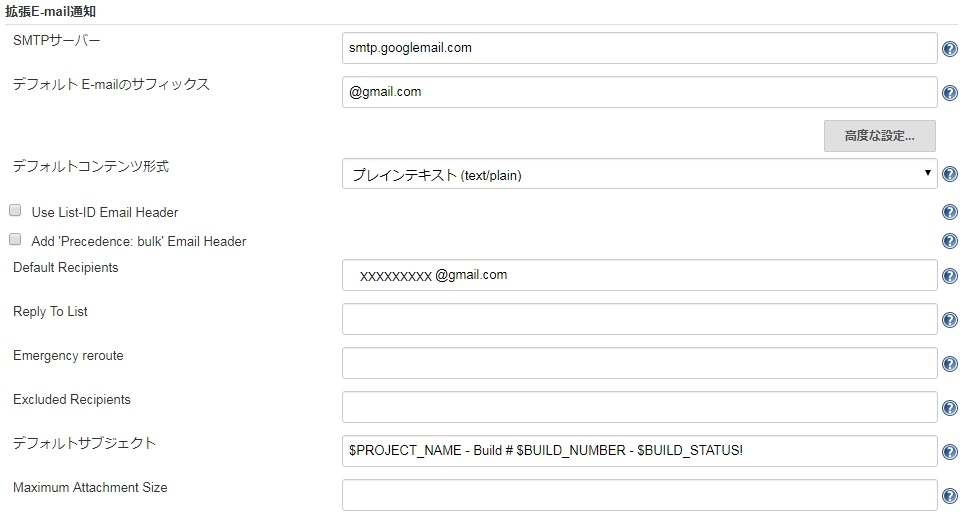


上記設定例では `${PROJECT_NAME}` などのトークンを利用して記述しています。

設定項目の最後にある「トークンリファレンス」のヒントを押下すると利用可能なトークンの一覧が表示されます。

適宜参考にしてください。

【トークンリファレンス 画像】


各ジョブでの設定

メール通知を設定したいジョブの [ 設定画面 ] → [ ビルド後の処理 ]にある[ ビルド後の処理の追加 ]を押下し、プルダウンメニューから[ E-mail通知 ]を選択します。

ジョブでの設定内容はシステムの設定で行ったものとほぼ同じです。また、システムで設定した項目を引き継ぐことも、あるいは個別に変更することも可能です。

参考例は第7章でご紹介します。

## 2-3. Hexo導入手順

本ガイドでは、静的ページジェネレータ [「 Hexo 」](https://hexo.io/)を利用した開発を想定しています。

1.　Hexo環境の導入手順

Hexo を導入する仮想サーバで作業を行います。

Hexo は Node で作成されているため Node.js の導入が必要となります。

Node.js 導入手順


参考サイト

- [node.js公式](https://nodejs.org)
- [nvm公式リポジトリ](https://github.com/creationix/nvm)

```
#node.jsのバージョン管理ツール nvm をgitから取得します。
yum -y install git
git clone https://github.com/creationix/nvm.git .nvm
source ~/.nvm/nvm.sh

#インストール可能なnode.jsのバージョンを確認
nvm ls-remote

#node.jsの導入
nvm install {バージョン}　
※例：v6.11.4（2017.10現在 最新安定版(LTS)）
※本ガイドでは導入の前提としてnodeのバージョンがv0.11.15以上必要です。

#nodeが正しく導入されたか確認します。
node -v

#nvmの設定
#デフォルトのバージョンを設定します。
nvm alias default {バージョン}

#nvmコマンドが実行できるように設定します。
vi ~/.bash_profile

if [[ -s ~/.nvm/nvm.sh ]];
 then source ~/.nvm/nvm.sh
fi

```

Hexo 導入手順

 ```
#Node.js と一緒にインストールされたパッケージマネージャ npm を利用して hexo を導入します。
  npm install hexo-cli -g

# Hexo の初期化。必要なファイル/フォルダが生成されます。
  hexo init [ Hexo作業用ディレクトリ名 ]

  cd [ ディレクトリ名 ]

# npm モジュールをインストールします。
  npm install

# Hexo サーバを起動しプレビューを確認します。
  hexo server
  INFO  Hexo is running at http://0.0.0.0:4000/. Press Ctrl+C to stop.

 ```
  INFO にある` http://localhost:4000/ ` にアクセスするとプレビューが表示されます。

  （プレビューの確認のためには4000番ポートを開放する必要があります。）


 以上で「 Hexo 」作業フォルダが準備できました。


2.　 Hexo 記事の作成と HTML の生成

 Hexo は Markdown 形式のファイルから HTMLファイル を作成します。

 Markdown 形式のファイルも Hexo で作成でき、新しい記事を追加していくことができます。

 ここでは「 Hello Hexo 」というタイトルで記事を作成していきます。

 Hexo を導入したディレクトリで次のコマンドを実行します。

 ` hexo new post  "Hello Hexo" `

 Hexo を導入したディレクトリ配下に` /source/_posts/Hello-Hexo.md ` が作成されます。

作成された Markdown ファイルの中は以下のようになっています。

```
source/_posts/Hello-Hexo.md

title: "Hello Hexo"
date: 2017-06-30 12:03:08
tags:
---

ここ以降は空欄になっており、本文記入欄になります。

Markdown 形式で記載します。

例：

# Hello Hexo !


```

記事の作成が完了したら Markdown 形式ファイルから HTML ファイルを作成します。

` hexo generate ` コマンドで htmlファイルが作成され、publicフォルダ以下に格納されます。

以上で「 Hexo 」に新たな記事が追加されました。<br/>

 【参考： Hexo画面 】

  

3.　 その他のHexoの使い方 

テーマ（theme）の変更

Hexoではテーマの変更も容易に行えます。
以下、テーマ変更手順です。

   1. サイトの<a href="https://hexo.io/themes/">theme</a>より好きなテーマを選びます。
   2. 選択したテーマのタイトルのGithubページからクローンを行います。
      - Hexoを導入したディレクトリ配下の themes ディレクトリがクローン先です。
      - 例：テーマ「Clean-blog」をthemesディレクトリへクローン
      - `git clone https://github.com/klugjo/hexo-theme-clean-blog.git themes/clean-blog`
   3. Hexoを導入したディレクトリ配下にある「_config.yml」を修正します。
      - デフォルトでは`theme: landscape`となっている部分を`theme: テーマ名`に変更します。
      - 例：`theme: clean-blog`

以上でテーマが変更できます。

【参考： Hexo画面 】

  

[[第3章 GitHub Enterprise環境構築へ]](github-enterprise.md)
