## 第8章 デモ実行と運用 <br/>

前章までで構築したCI環境をもとにCI(継続的インテグレーション)を実施します。<br/>

[「想定利用シナリオ」](#scenario)をもとに作業し、運用していきます。<br/>

------------------------------------------------------------------------------------

### 8-1.「想定利用シナリオ」の実行と運用

概要の[シナリオ運用概要図](#ci_02)どおりに作業を進めます。

**開発資産取得**<br/>
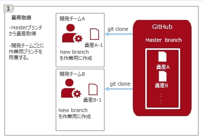
　<br/>

各開発チームが作業を行う前にGitHub Enterpriseのリポジトリのmasterブランチから資産を取得します。<br/>

手順は[「第3章 3-2.PullRequest と Merge 」](#git_function)で紹介したとおりです。<br/>

ここでは、<br/>
- 資産管理のリモートリポジトリ名を「CI_Guide」
- リポジトリ「CI_Guide」のmasterブランチには開発資産がすでに格納されている前提
- 開発作業用のブランチ名を「team_A」<br/>

として実行します。<br/>

開発チームの仮想サーバへ資産管理のリモートリポジトリ「CI_Guide」をクローンします。<br/>

`git clone https://github.com/ユーザ名/CI_Guide.git`<br/>

次に開発チームの作業用ブランチ「team_A」を作成します。<br/>

`git checkout -b team_A`<br/>

作成したブランチに入り作業します。<br/>

**ブランチをPush**<br/>
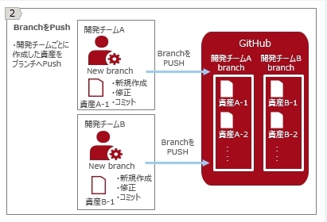
　<br/>

開発チームでの作業が完了したら、リモートリポジトリ「CI_Guide」へPushします。<br/>

手順は同じく[「第3章 3-2.PullRequest と Merge 」](#git_function)で紹介したとおりです。<br/>

ここでは「ci_test.md」ファイルを作成し、リモートリポジトリへPushします。

```
# 作成したファイルをインデックスに追加。
git add ci_test.md

# コミットしメッセージ「開発チームＡ」をつけます。
git commit -m "開発チームＡ"

# 作業用ブランチ「team_A」へプッシュします。
git push -u origin team_A
```
正しくPushできたかGitHub Enterpriseの画面で確認します。<br/>

【リモートリポジトリ「CI_Guide」画面その１】
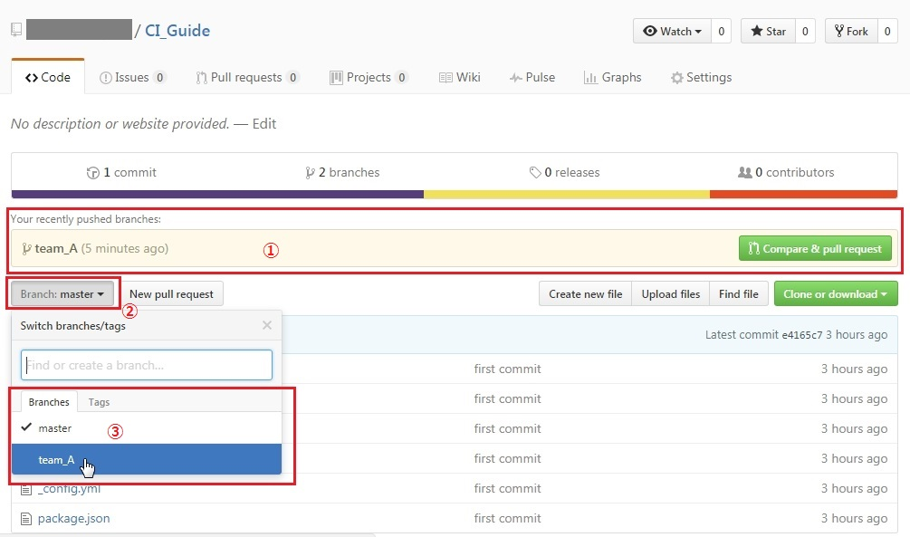
　<br/>
赤枠①「Your recently pushed branches」に最近pushしたブランチが表示されます。<br/>
赤枠② [Branch:master]をプルダウンすると、<br/>
赤枠③ 開発チーム用に作成した「team_A」ブランチが表示されます。<br/>

赤枠③の「team_A」ブランチを選択して画面を遷移させます。<br/>

【リモートリポジトリ「CI_Guide」画面その２】
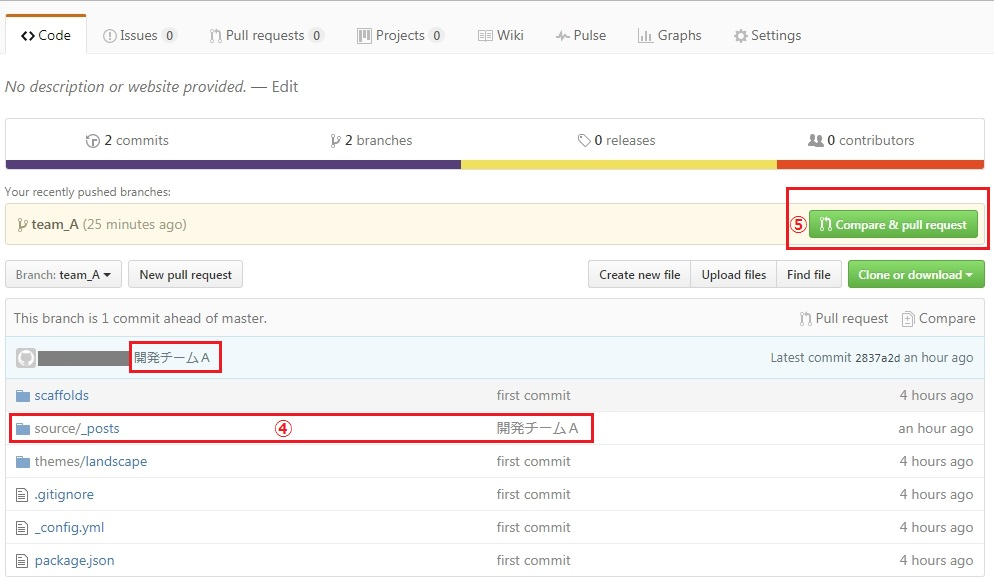
　<br/>

赤枠④にコミットする際につけたメッセージ「開発チームＡ」が正しく表示されています。<br/>
ブランチにPushしたファイルは「ci_test.md」は「souce/_posts」フォルダに格納されました。<br/>

**Pull Requestを契機にJenkinsの作動**<br/>

ブランチに正しく資産が格納できましたら、レビュー依頼 Pull Requestを作成します。<br/>
想定利用シナリオではこのPull Requestを契機にJenkinsが実行されます。<br/>
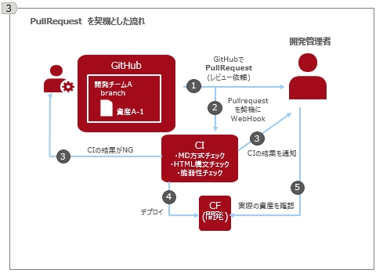
　<br/>

以下シナリオにしたがって実行していきます。<br/>

**シナリオ①「GitHubでPullRequest（レビュー依頼）」**<br>

前掲【リモートリポジトリ「CI_Guide」画面その２】の赤枠⑤からPull Requestを作成します。<br/>
手順は第3章の[「PullRequest 手順」](#pullreq)の通りです。<br/>

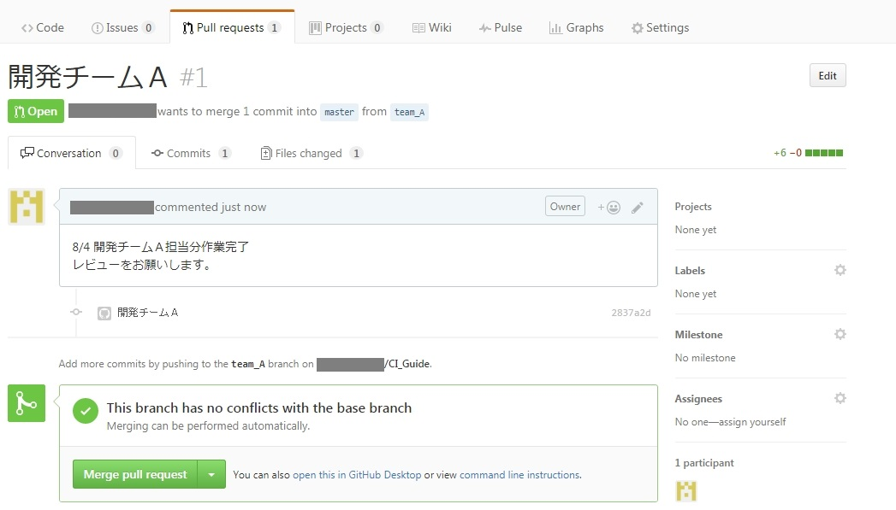
　<br/>

**シナリオ②「PullRequestを契機にwebhook」**<br>

PullRequestを作成するとJenkinsの[『「Pullrequest用 Pipeline」のScript 記述例』](#script_pullreq)で作成したPipelineが作動します。<br/>
本ガイドでは「pullrequest_teamA」という名で作成し実行しました。<br/>
Jenkins画面で確認します。<br/>
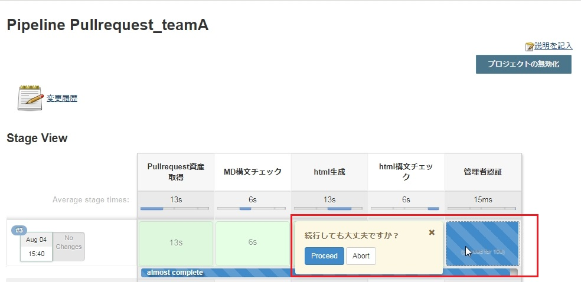
　<br/>
「管理者認証」のステージで一時停止していることが確認できます。<br/>
メール通知を設定していれば、メールを確認後、この画面から認証をしてPipelineを続行させます。<br/>
全てのステージが完了すれば以下のような画面になります。<br/>
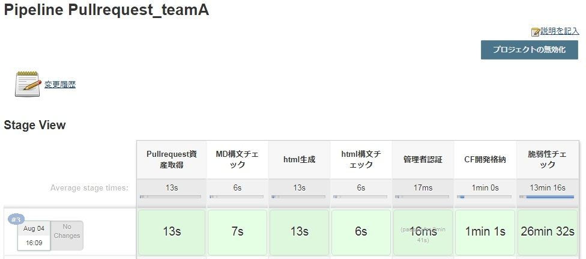
　<br/>

**シナリオ③ CIの結果を通知**<br>
Pipelineの結果は設定したメールにて管理者に報告されます。<br/>
管理者はソースのレビュー結果とPipelineで実施された各種テストの結果を検討します。<br/>

**シナリオ④デプロイ　⑤実際の資産の確認**<br>
デプロイの確認は、ジョブの [ コンソール出力 ]に表示されたCFアップロード結果のURLで確認できます。 <br/>
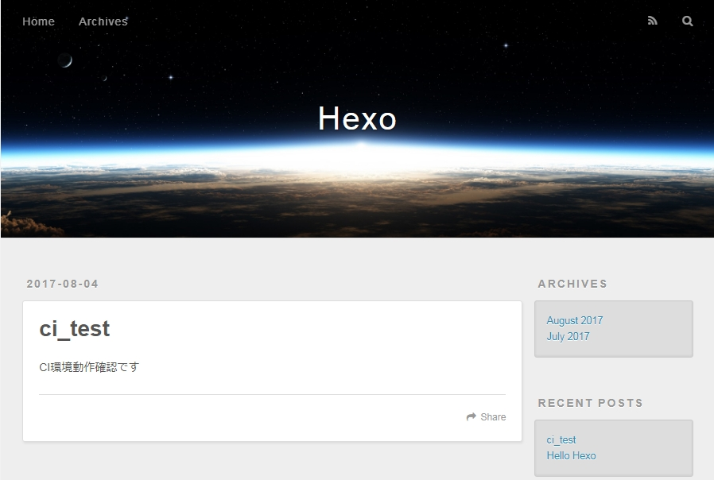
　<br/>
上記画像では開発チームＡが作成した「ci_test.md」ファイルからhtmlファイルが生成され、正しく表示されていることが分かります。<br/>

**Mergeを契機にJenkinsの作動**<br/>

管理者はソースのレビュー結果とPipelineで実施された各種テストの結果を検討し、さらにデプロイされた資産の確認を行い、全て問題なければ開発資産の統合を行います。<br/>
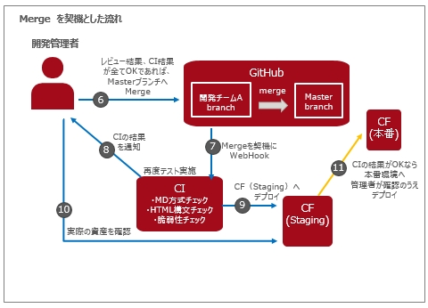
　<br/>

**シナリオ⑥ masterブランチへMerge**<br>

GitHub Enterpriseの対象リポジトリの画面からmergeを行います。<br/>
手順は第3章の[「Merge 手順」](#merge)の通りです。<br/>

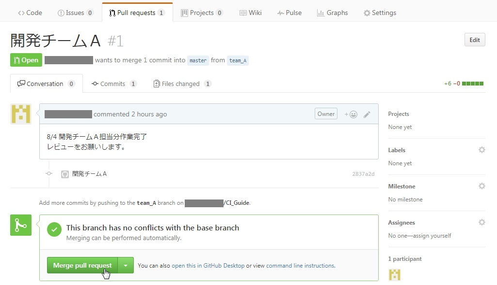
　<br/>

画面の[Merge Pull Request]を押下すると資産が統合され、以下のように結果が表示されます。<br/>

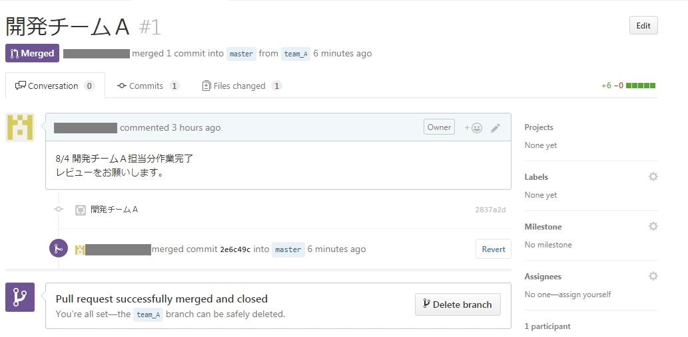
　<br/>

**シナリオ⑦ 「Merge を契機にwebhook」**<br>

MergeされるとJenkinsの[『「Merge用 Pipeline」のScript 記述例』](#script_merge)で作成したPipelineが作動します。<br/>

本ガイドでは「guide_merge」という名で作成し実行しました。<br/>

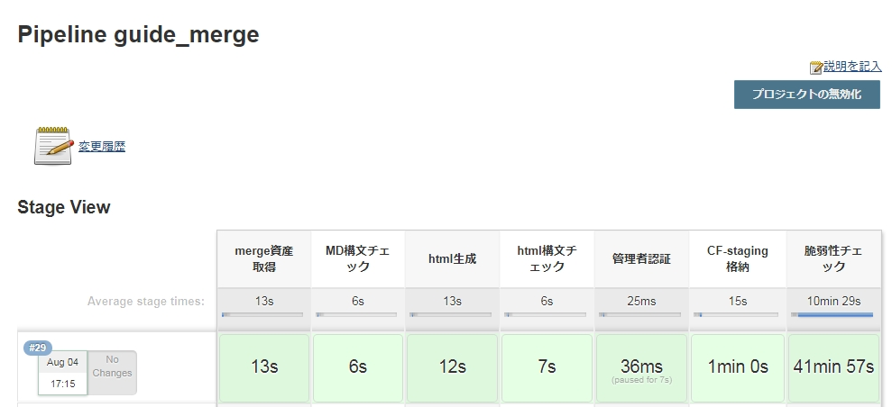
　<br/>

以下、シナリオ⑧から⑩まではPullRequestの場合とほぼ同じです。<br/>

**シナリオ⑪ CF（本番）へデプロイ**<br>

本ガイドではCF(Staging)デプロイまでをJenkinsで自動化しました。<br/>
公開用サーバであるCF（本番）は安全面等を考慮し手動でデプロイする運用として想定しました。<br/>
以上で想定利用シナリオの 「 チーム開発で静的ウェブページを作成し、公開するまでCIを実施する 」 ことが完了しました。<br/>

　<br/>

## おわりに<br/>

本ガイドでは「FUJITSU Cloud Service K5」を利用したCI環境の構築について紹介しました。<br/>
本ガイドを参考に、プロジェクトの環境や状況にあわせてCI環境をK5上に構築してください。<br/>

