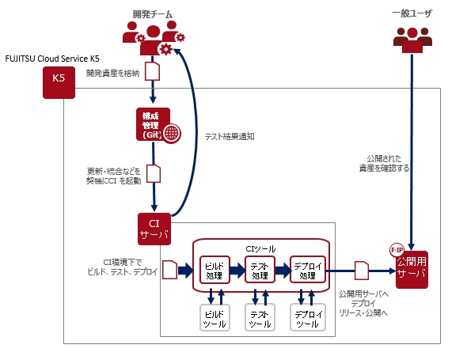
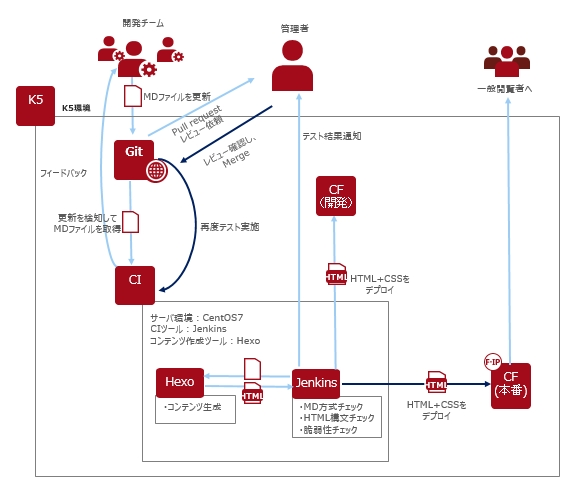
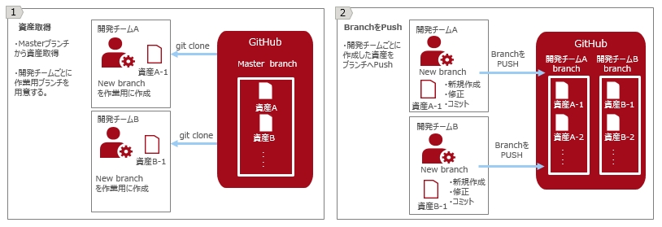
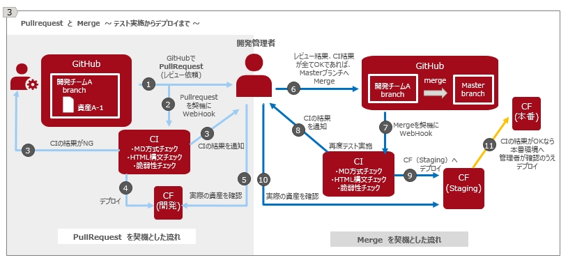

# 概要

## 1. CI ( 継続的インテグレーション ) について

チーム開発において開発資産統合時に問題が発生することは、プロジェクトの進捗や結果に大きく影響を与えます。 
また、手動でビルドやテストを頻繁に繰り返すことは開発者に負担をかけ、プロジェクト全体に非効率化をもたらします。 
これらの問題を解消させるために、CI（継続的インテグレーション）を導入し、実践します。 
CI環境を構築することで、ビルド・テスト・デプロイを自動化することができ、開発者の負担を軽減します。このプロセスを何度も繰り返し、不具合などを早期に発見し、品質改善や納期の短縮を実現することが可能になります。 

## 2.CI環境の構成

本ガイドでは、想定する利用シナリオにあわせたCI環境をK5上に構築し、CIを実現します。

------------------------------------------------------------------------------------------------

### 基本システム構成

K5上でCI環境を構築するための基本システムを紹介します。 
以下のシステムを基本とし、実際の利用シーンにあわせて構成を変更していきます。 

 名称                             | 詳細
:-------------------------------- | :--------------------------------
仮想サーバ                        | K5上に仮想サーバを構築します。
構成管理ツール                    | K5提供の「GitHub Enterprise」を利用します。
公開用サーバ (実行基盤)           | K5提供のCFの利用。
CIツール                          | 使用したいツールを選択し、仮想サーバへ導入
テストツール                      | 使用したいツールを選択し、仮想サーバへ導入

中核となるシステム構成要素の動きは以下の通りです。 
- 構成管理ツールで開発資産を管理
- 仮想サーバへ導入したCIツールを通じてCI実施
- 公開用サーバ（実行基盤）へデプロイ  

【基本システム構成図 】 
  
　 

### 想定利用シナリオ 

利用シナリオとして 「 チーム開発で静的ウェブページを作成し公開する 」 ことを想定します。

>■ 登場人物 
>　管理者と開発チーム 
>　・ 管理者（権限管理者、本番環境デプロイ責任者）･･･１名 
>　・ 開発チーム・・・開発機能ごとに複数のチームに分かれます。 
>
>
>■ 想定する開発内容 
>　ページの修正・追加を継続的にすばやく行えるようにします。 
>　開発ツールとして静的ページジェネレーター「Hexo」を使用します。 
>
>
>■ 開発の流れ 
>　開発チームによる作業 
>　　開発ツール「Hexo」を利用して、Markdown形式で記事を作成し、Html形式の静的ページを生成します。 
>　　開発した資産をテストサーバにデプロイします。 
>　　開発資産形成の各段階で構文チェックテストやアタックテストなどを行い、品質管理も実施します。 
>　　チーム担当分の開発作業が完了したら管理者へレビュー依頼を出します。 
>　 
>　管理者による作業 
>　　レビュー結果がOKであるならば、資産を統合し、本番環境へデプロイします。 
>　　品質管理を徹底させるため資産統合後も再度各種テストを行ったうえで本番環境へデプロイします。 
>
>
>■ シナリオの目標 
>CI ( 継続的インテグレーション ) を実施したい。 
>　　チーム開発での効率的な資産管理を行い、テスト自動化と通知機能を活用し、 
>　　制作から公開までの期間短縮と開発作業の負担軽減をめざします。 
>
>具体的には、開発チームによる作業においては、実質 `MDファイル作成` のみを行い、CIを導入することで、以下の流れの自動化をめざします。 
>　　　` MD構文チェック → HTML生成 → HTML構文チェック → テストサーバーデプロイ → ` 
>　　　` → アタックテスト → レビュー依頼` 
>

　 

### 想定利用シナリオを基にしたシステム構成

想定利用シナリオにふさわしいCI環境を構築するシステムの構成です。 
本ガイドで構築するCI環境はFUJITSU Cloud Service K5を利用し、以下のシステム、各種ツールを使用しています。 

K5提供サービス 名称               | 詳細
:-------------------------------- | :--------------------------------
CentOS (仮想マシン)               | CentOS 7.x 64bit 英語版
GitHub Enterprise(構成管理ツール ) | K5 提供サービス
CF (実行基盤)                     | K5提供のアプリケーション実行環境サービス

各種ツール 名称                   | 詳細
:-------------------------------- | :--------------------------------
Jenkins                           | CIツール  Jenkins 2.0以上
Hexo                              | 静的ページジェネレーター
Markdownlint                      | Markdown構文チェックツール
Htmlhint                          | Html構文チェックツール
Skipfish                          | セキュリティ調査ツール

　 

### システム構成図とシナリオ運用概要図

K5の各種サービスとツールを組み合わせたCI環境のシステム構成図は以下の通りです。 

【システム構成図 】 
  
　 

想定利用シナリオでCI環境を運用した概要図です。 
詳しくは第7章、8章で構築手順を示しながら紹介します。 

【シナリオ運用概要図 】 
  
  

[[第1章 K5 IaaS環境構築へ]](iaas.md)
