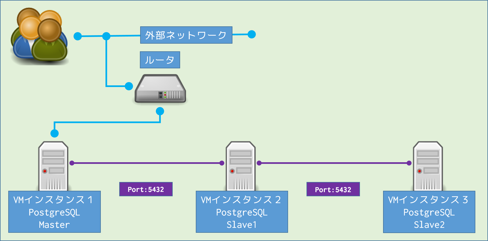

PostgreSQL Cluster マルチインスタンス<br>テンプレート概要説明
====

<br>

### 概要

PostgreSQLを３つのインスタンスにインストールし、クラスタ化します。

<br>

### 作成されるシステムの構成図



<br>

### インスタンスの詳細

#### インスタンス１

|項目|内容|
|---|---|
|OS|CentOS 6.5 64bit|
|イメージタイプ|CentOS 6.5 64bit (English) 05|
|フレーバータイプ|S-1|
|ボリュームタイプ|M1|

<br>

#### インストールするソフトウェア

>|ソフトウェア|バージョン|ライセンス|説明|
>|---|---|---|---|
>|Postgres|9.5|[PostgreSQL License](https://opensource.org/licenses/postgresql)|PostgreSQLパッケージ|

<br>

---

#### インスタンス２

|項目|内容|
|---|---|
|OS|CentOS 6.5 64bit|
|イメージタイプ|CentOS 6.5 64bit (English) 05|
|フレーバータイプ|S-1|
|ボリュームタイプ|M1|

<br>

#### インストールするソフトウェア

>|ソフトウェア|バージョン|ライセンス|説明|
>|---|---|---|---|
>|Postgres|9.5|[PostgreSQL License](https://opensource.org/licenses/postgresql)|PostgreSQLパッケージ|

<br>

---

#### インスタンス３

|項目|内容|
|---|---|
|OS|CentOS 6.5 64bit|
|イメージタイプ|CentOS 6.5 64bit (English) 05|
|フレーバータイプ|S-1|
|ボリュームタイプ|M1|

<br>

#### インストールするソフトウェア

>|ソフトウェア|バージョン|ライセンス|説明|
>|---|---|---|---|
>|Postgres|9.5|[PostgreSQL License](https://opensource.org/licenses/postgresql)|PostgreSQLパッケージ|

<br>

### 作成方法

1. トークンとorchestrationのエンドポイントを取得します。
1. 下記のフォーマットでパラメタファイルを用意します。<br>必要なパラメタを過不足なく指定します。<br>最後のパラメタには「,」が不要です。<br>パラメタの詳細は作成時パラメタを参照してください。
    >```json
    >"parameters": {
    >    "パラメタ１名": "値",
    >    "パラメタ２名": "値",
    >    "パラメタ３名": "値",
    >              ・
    >              ・
    >              ・
    >    "パラメタｎ名": "値"
    >}
    >```

1. スタックネームとHeatテンプレートファイルネームを指定し下記のコマンドでスタック情報ファイルを作成します。
    >```bash
    >echo "{" > スタック情報ファイル
    >echo "    \"stack_name\": \"スタックネーム\"," >> スタック情報ファイル
    >echo -n "    \"template\":\"" >> スタック情報ファイル
    >cat Heatテンプレートファイルネーム | \
    >    sed -e 's/\\/\\\\/g' | \
    >    awk -F\n -v ORS='\\n'  '{print}' | \
    >    sed -e 's/\"/\\"/g' | \
    >    sed -e 's/`/\\`/g' | \
    >    sed -e 's/\r/\\r/g' | \
    >    sed -e 's/\f/\\f/g' | \
    >    sed -e 's/\t/\\t/g' >> スタック情報ファイル
    >echo "\"" >> スタック情報ファイル
    >echo "    ," >> スタック情報ファイル
    >cat パラメタファイル >> スタック情報ファイル
    >echo -n "}" >> スタック情報ファイル
    >```

1. 取得したトークン、orchestrationのエンドポイント、スタック情報ファイルを以って下記のcurlコマンドを実行しスタックを作成します。
    >```bash
    >curl -k -H "X-Auth-Token: トークン" -X POST \
    >  -H "Content-Type: application/json" -H "Accept: application/json" \
    >  orchestrationのエンドポイント/stacks -d @スタック情報ファイル --verbose
    >```

<br>

### 作成時パラメタ

|パラメタ名|入力する値の型|説明|
|---|---|---|
|keypair_name|string|使用する証明書の鍵を指定|
|availability_zone|string|アベイラビリティーゾーンを指定|
|dns_nameservers|comma_delimited_list|DNSネームサーバを指定<br>`['xxx.xxx.xxx.xxx', 'yyy.yyy.yyy.yyy']`形式|
|network_id_postgre_cluster1|string|インスタンス１が所属するネットワークIDを指定|
|subnet_id_postgre_cluster1|string |インスタンス１が所属するサブネットIDを指定|
|network_id_postgre_cluster2|string|インスタンス２が所属するネットワークIDを指定|
|subnet_id_postgre_cluster2|string |インスタンス２が所属するサブネットIDを指定|
|network_id_postgre_cluster3|string|インスタンス３が所属するネットワークIDを指定|
|subnet_id_postgre_cluster3|string |インスタンス３が所属するサブネットIDを指定|
|cluster1_host_cider|string|インスタンス１へのSSH接続を許可するCIDRを指定|
|cluster2_host_cider|string|インスタンス２へのSSH接続を許可するCIDRを指定|
|cluster3_host_cider|string|インスタンス３へのSSH接続を許可するCIDRを指定|
|remote_host_cidr|string|サーバへのSSH接続を許可するCIDRを指定|
|flavor|string|作成するインスタンスのフレーバーを指定|

<br>

### セキュリティグループ

#### 共通

|プロトコル|ingress|egress|対象IPアドレス|ポート|
|---|---|---|---|---|
|ICMP|●|－|remote_host_cidr|ICMP |
|ICMP|－|●|0.0.0.0/0|ICMP |
|SSH(TCP)|●|－|remote_host_cidr|22|
|HTTP(TCP)|－|●|0.0.0.0/0|80|
|HTTPS(TCP)|－|●|0.0.0.0/0|443|
|TCP|－|●|dns_nameservers,0|53|
|TCP|－|●|dns_nameservers,1|53|
|UDP|－|●|dns_nameservers,0|53|
|UDP|－|●|dns_nameservers,1|53|
|TCP|－|●|169.254.169.254/32|80|

<br>

---

#### インスタンス１

|プロトコル|ingress|egress|対象IPアドレス|ポート|
|---|---|---|---|---|
|TCP|●|－|cluster2_host_cider|5432|
|TCP|－|●|cluster2_host_cider|5432|
|TCP|●|－|cluster3_host_cider|5432|
|TCP|－|●|cluster3_host_cider|5432|

<br>

---

#### インスタンス２

|プロトコル|ingress|egress|対象IPアドレス|ポート|
|---|---|---|---|---|
|TCP|●|－|cluster1_host_cider|5432|
|TCP|－|●|cluster1_host_cider|5432|
|TCP|●|－|cluster3_host_cider|5432|
|TCP|－|●|cluster3_host_cider|5432|

<br>

---

#### インスタンス３

|プロトコル|ingress|egress|対象IPアドレス|ポート|
|---|---|---|---|---|
|TCP|●|－|cluster1_host_cider|5432|
|TCP|－|●|cluster1_host_cider|5432|
|TCP|●|－|cluster2_host_cider|5432|
|TCP|－|●|cluster2_host_cider|5432|

<br>

### 出力情報

３インスタンスのIPアドレスを`http://xxx.xxx.xxx.xxx`形式で出力

<br>

### 起動方法

出力情報のインスタンス１IPアドレスにブラウザからアクセス

<br>

### その他

---
