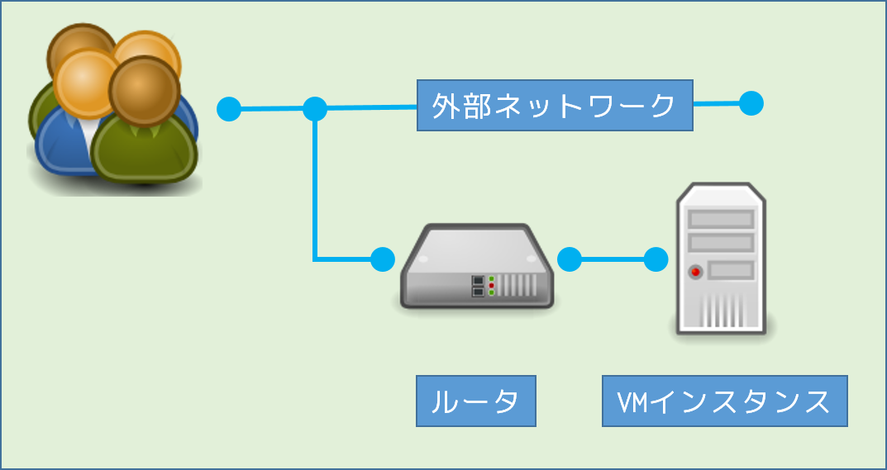

Apache + Node.js シングルインスタンス<br>テンプレート概要説明
====

<br>

### 概要

１つのインスタンス上にWebサーバ（Apache）、Node.jsをインストールし、連携させます。Node.js上で機能する簡易Appサーバを配置します。

<br>

### 作成されるシステムの構成図



<br>

### インスタンスの詳細

|項目|内容|
|---|---|
|OS|CentOS 6.5 64bit|
|イメージタイプ|CentOS 6.5 64bit (English) 05|
|フレーバータイプ|S-1|
|ボリュームタイプ|M1|

<br>

#### インストールするソフトウェア

|ソフトウェア|バージョン|ライセンス|説明|
|---|---|---|---|
|Apache|2.2系|[Apache License, Version 2.0](http://www.apache.org/licenses/LICENSE-2.0)|HTTPサーバ<br>yumによるインストール|
|Node.js|4系|[MIT License](https://opensource.org/licenses/mit-license.php)|サーバーサイドJavaScript環境|

<br>

### 作成方法

1. トークンとorchestrationのエンドポイントを取得します。
1. 下記のフォーマットでパラメタファイルを用意します。<br>必要なパラメタを過不足なく指定します。<br>最後のパラメタには「,」が不要です。<br>パラメタの詳細は作成時パラメタを参照してください。
    ```
    "parameters": {
        "パラメタ１名": "値",
        "パラメタ２名": "値",
        "パラメタ３名": "値",
                  ・
                  ・
                  ・
        "パラメタｎ名": "値"
    }
    ```

1. スタックネームとHeatテンプレートファイルネームを指定し下記のコマンドでスタック情報ファイルを作成します。
    ```
    echo "{" > スタック情報ファイル
    echo "    \"stack_name\": \"スタックネーム\"," >> スタック情報ファイル
    echo -n "    \"template\":\"" >> スタック情報ファイル
    cat Heatテンプレートファイルネーム | \
        sed -e 's/\\/\\\\/g' | \
        awk -F\n -v ORS='\\n'  '{print}' | \
        sed -e 's/\"/\\"/g' | \
        sed -e 's/`/\\`/g' | \
        sed -e 's/\r/\\r/g' | \
        sed -e 's/\f/\\f/g' | \
        sed -e 's/\t/\\t/g' >> スタック情報ファイル
    echo "\"" >> スタック情報ファイル
    echo "    ," >> スタック情報ファイル
    cat パラメタファイル >> スタック情報ファイル
    echo -n "}" >> スタック情報ファイル
    ```

1. 取得したトークン ($OS_AUTH_TOKEN)、orchestrationのエンドポイント、スタック情報ファイルを以って下記のcurlコマンドを実行しスタックを作成します。
    ```
    curl -k -H "X-Auth-Token: $OS_AUTH_TOKEN" -X POST \
      -H "Content-Type: application/json" -H "Accept: application/json" \
      orchestrationのエンドポイント/stacks -d @スタック情報ファイル --verbose
    ```

<br>

### 作成時パラメタ

|パラメタ名|入力する値の型|説明|
|---|---|---|
|keypair_name|string|使用する証明書の鍵を指定|
|availability_zone|string|アベイラビリティーゾーンを指定|
|dns_nameservers|comma_delimited_list|DNSネームサーバを指定<br>`['xxx.xxx.xxx.xxx', 'yyy.yyy.yyy.yyy']`形式|
|network_id|string|インスタンスが所属するネットワークIDを指定|
|subnet_id|string|インスタンスが所属するサブネットIDを指定|
|remote_host_cidr|string|サーバへのSSH接続を許可するCIDRを指定|
|flavor|string|作成するインスタンスのフレーバーを指定|

<br>

### セキュリティグループ

|プロトコル|ingress|egress|対象IPアドレス|ポート|
|---|---|---|---|---|
|ICMP      |●|－|remote_host_cidr  |ICMP |
|SSH(TCP)  |●|－|remote_host_cidr  |SSH  |
|HTTP(TCP) |－|●|0.0.0.0/0         |HTTP |
|HTTPS(TCP)|－|●|0.0.0.0/0         |HTTPS|
|TCP       |－|●|dns_nameservers,0 |DNS  |
|TCP       |－|●|dns_nameservers,1 |DNS  |
|UDP       |－|●|dns_nameservers,0 |DNS  |
|UDP       |－|●|dns_nameservers,1 |DNS  |
|TCP       |－|●|169.254.169.254/32|HTTP |

<br>

### 出力情報

インスタンスのIPアドレスを`http://xxx.xxx.xxx.xxx`形式で出力

<br>

### 起動方法

出力情報のIPアドレスにブラウザからアクセス

<br>

### その他

---
