# IaaS Heat テンプレート利用ガイド

## 本書の目的

公開済みのHeatテンプレートを使用して、スタックを作成するための手順を示します。

## 前提

K5上のアカウントが以下のロールを有している必要があります。

- 設計・構築者ロール(cpf\_systemowner)※ロールについては機能説明書を、ロールの設定方法についてはAPIリファレンスを参照して下さい。

## 参考資料

- FUJITSU Cloud Service K5 IaaS 機能説明書
- FUJITSU Cloud Service K5 IaaS API リファレンス
- FUJITSU Cloud Service K5 IaaS API ユーザーズガイド
- FUJITSU Cloud Service K5 IaaS サービスポータルユーザーズガイド

## 手順

### テンプレートファイルのダウンロード

1. [テンプレート一覧のページ](https://github.com/k5-community/developer/tree/master/iaas-templates)を開きます。

1. 利用したいテンプレートファイルのリンクをクリックします。
  例えば、apache\_tomcat\_single\_c6\_select.yamlを利用したい場合は、以下の赤枠をクリックします。
  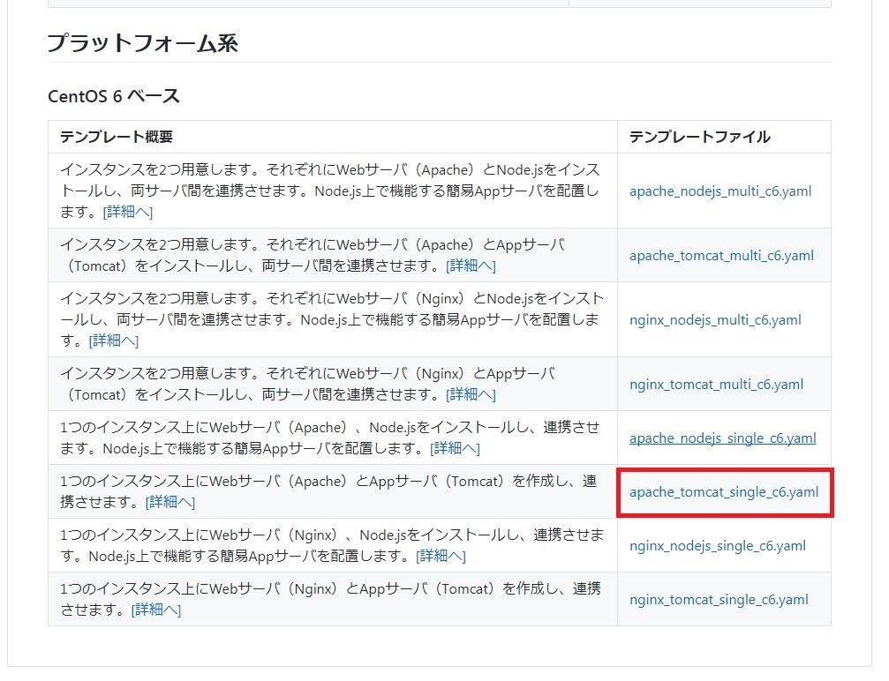

1. テンプレートのページが表示されるので、「Raw」を右クリック後、「名前を付けてリンク先を保存」を選択し、ファイルとして保存します。

### スタックの作成

1. K5のIaaSポータルにログインします。

1. 作成対象のリージョン及びプロジェクトを選択します。

1. メニューの「テンプレート＞スタック」をクリックします。
  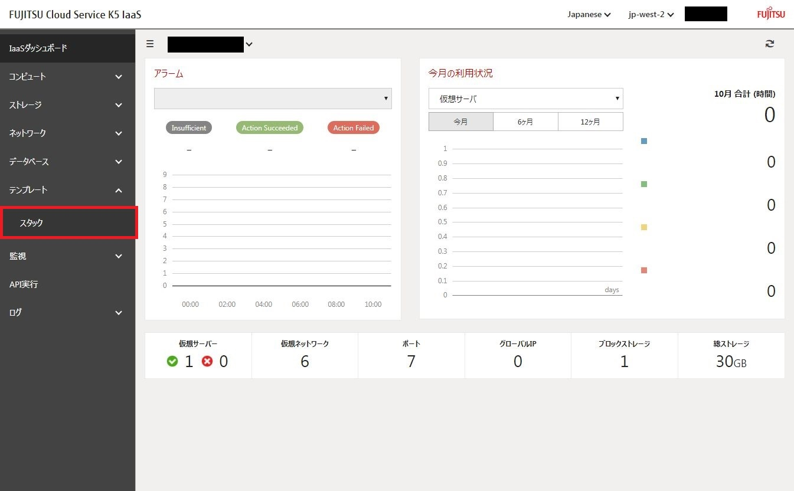

1. 右上の「＋」をクリックし、スタック作成画面を表示します。
  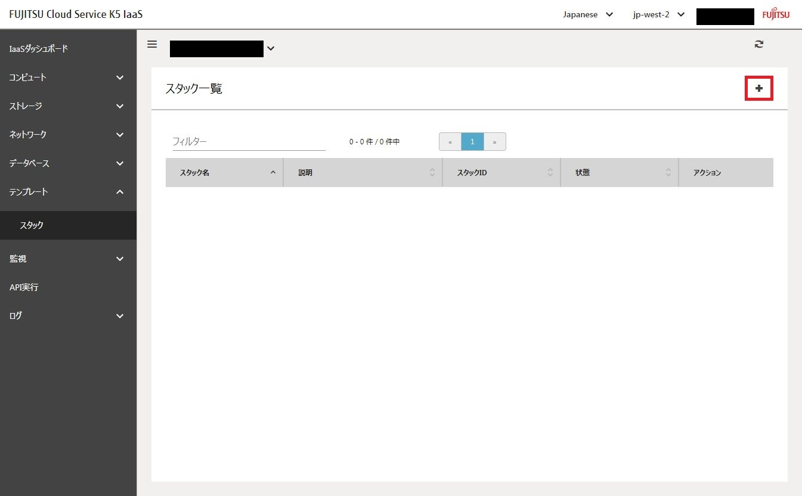

1. スタック名を指定します。既存のスタックと重複しないように注意して下さい。
  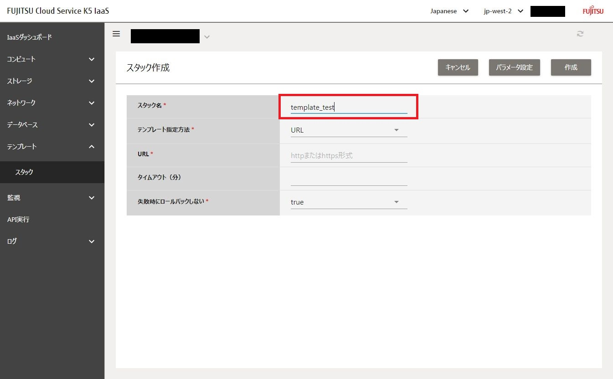

1. テンプレート指定方法でファイルを選択します。
  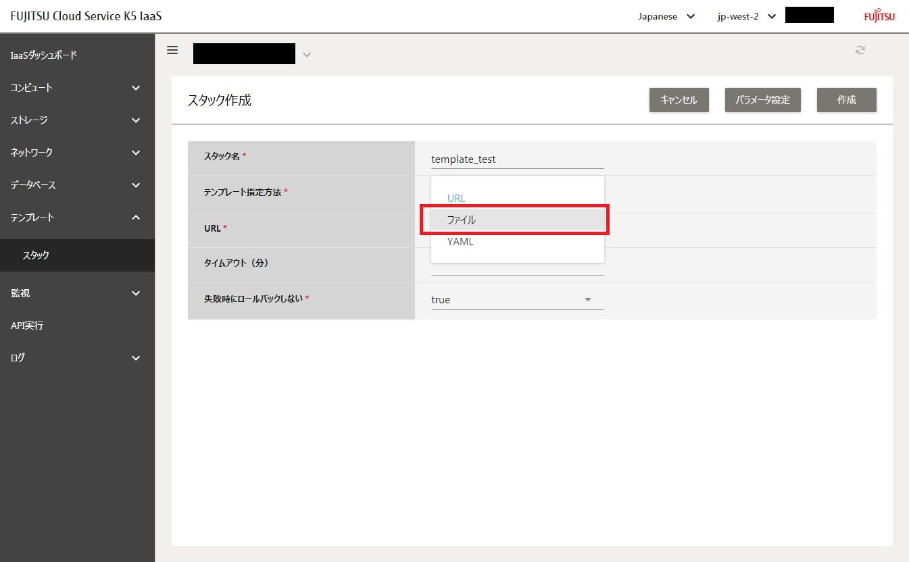

1. 「テンプレートファイルのダウンロード」で保存したファイルをドラッグ＆ドロップします。
  

1. 右上の「パラメータ設定」をクリックし、パラメータ設定画面を表示します。
  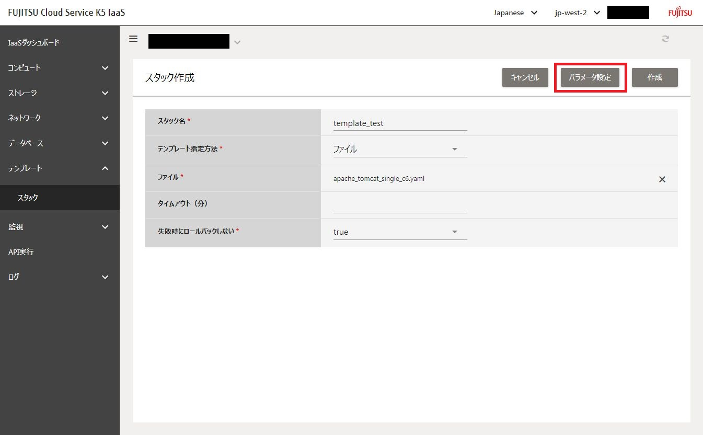

1. 各パラメータを入力します。
  各パラメータの詳細については、テンプレート一覧から該当テンプレートの「詳細へ」をクリックし
  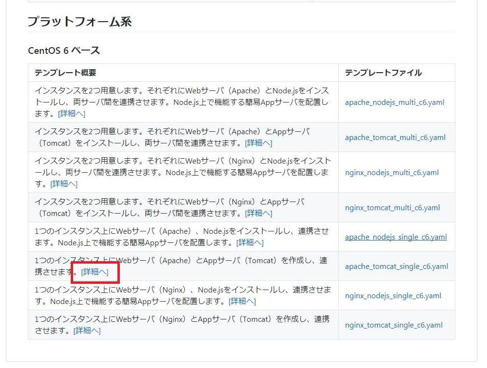
  リンク先のテンプレート説明用mdファイル内の「作成時パラメタ」を参照して下さい。
  
  以下は、入力例になります。
  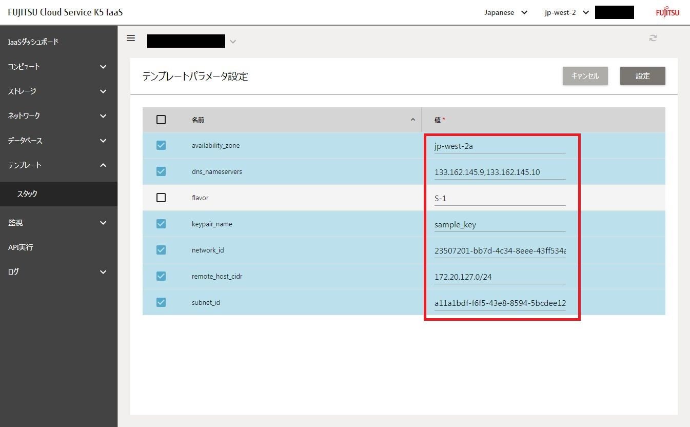
  入力したパラメータはチェック状態にして下さい。

1. 「設定」をクリックします。
  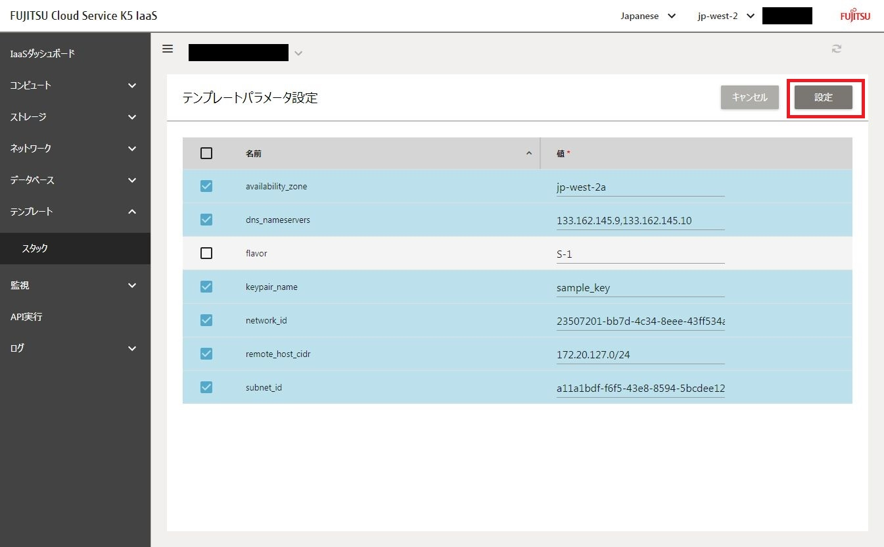

1. 確認メッセージが表示されるので、「設定」をクリックし、スタック作成画面に戻ります。
  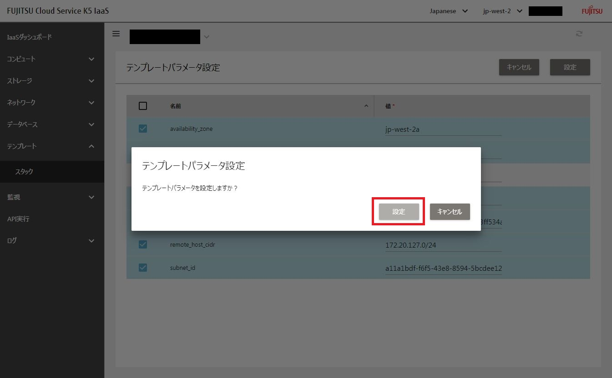

1. 右上の「作成」をクリックします。
  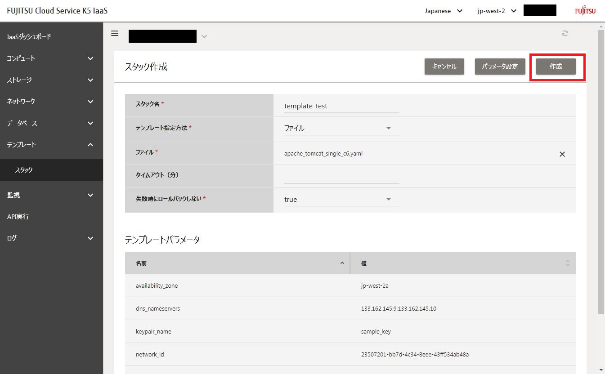

1. 受付完了のメッセージが表示されたら「閉じる」をクリックします。※表示まで時間がかかる場合があります。
  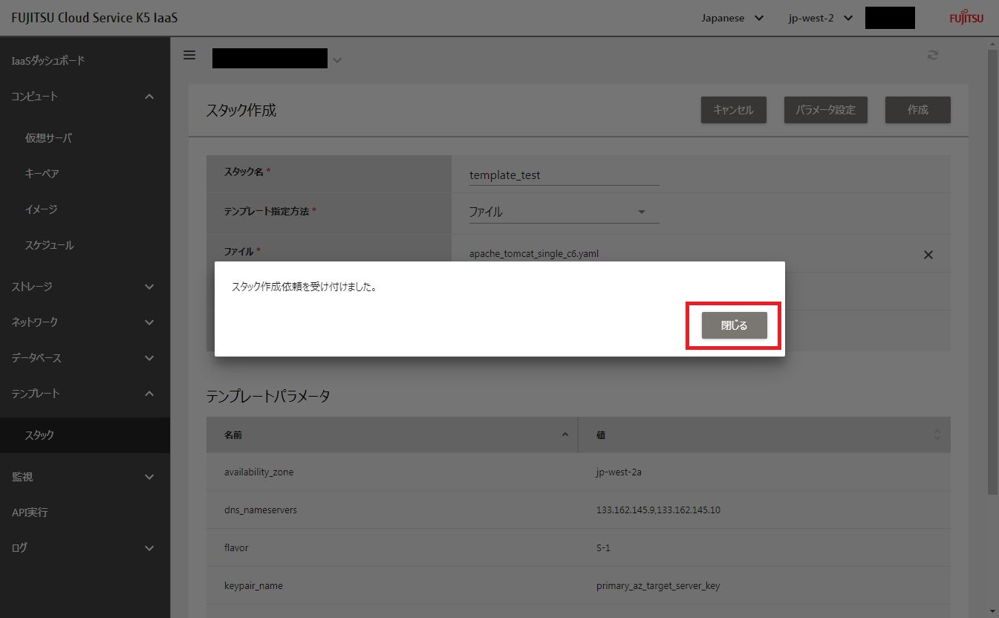

1. スタック一覧のページで、指定したスタック名のものが「CREATE\_IN\_PROGRESS」になっている事を確認します。
  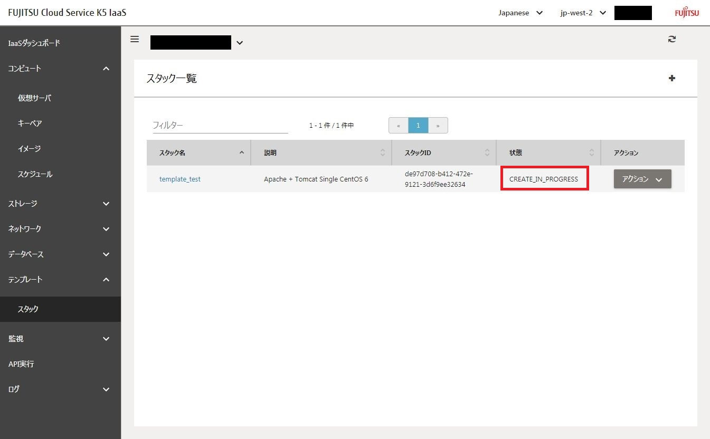

1. 何度かページの更新を行い、「CREATE\_COMPLETE」と表示されれば、スタックの作成が完了しています。
  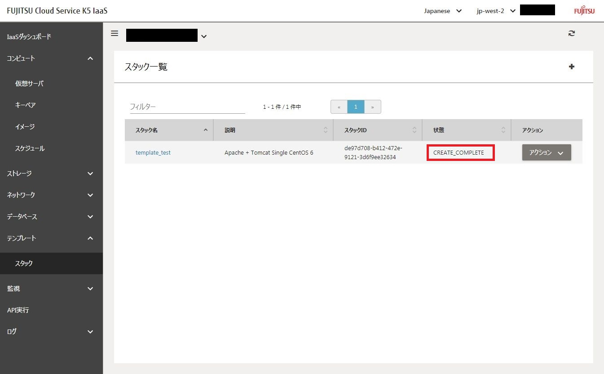
